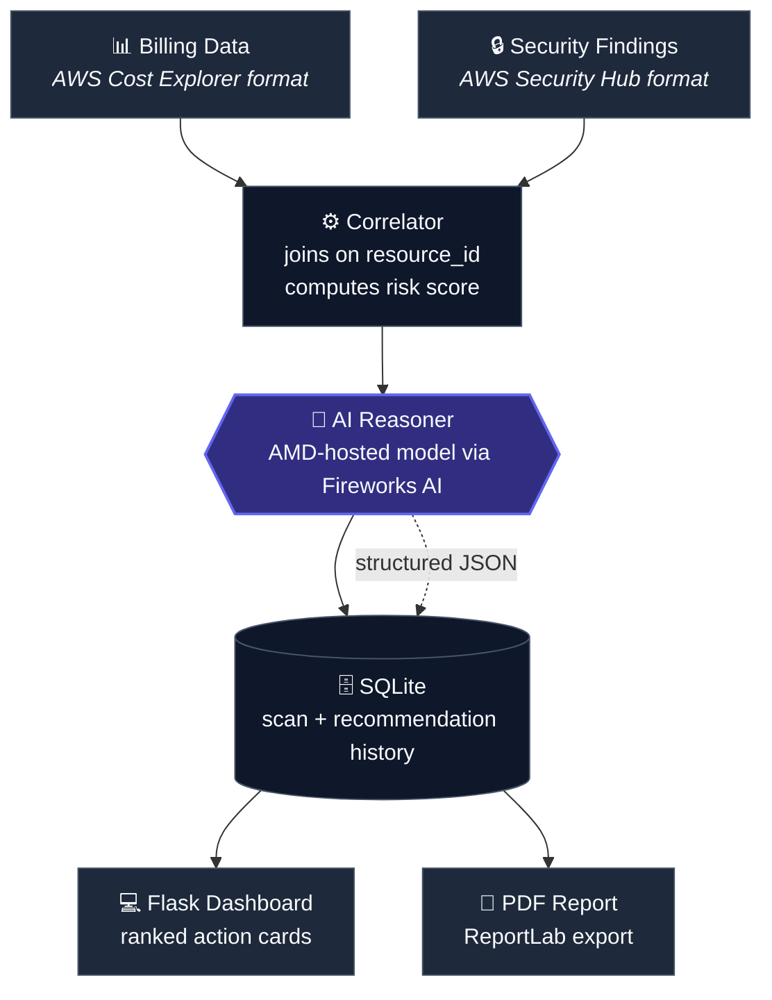
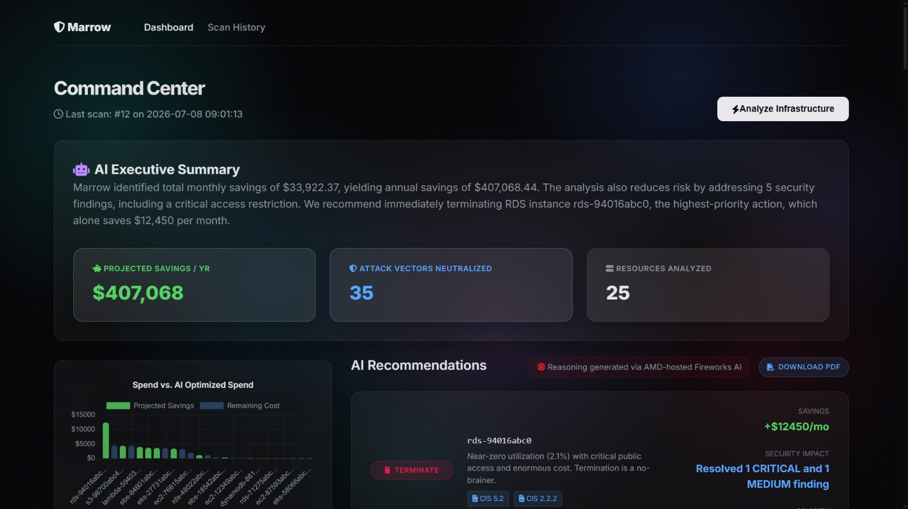
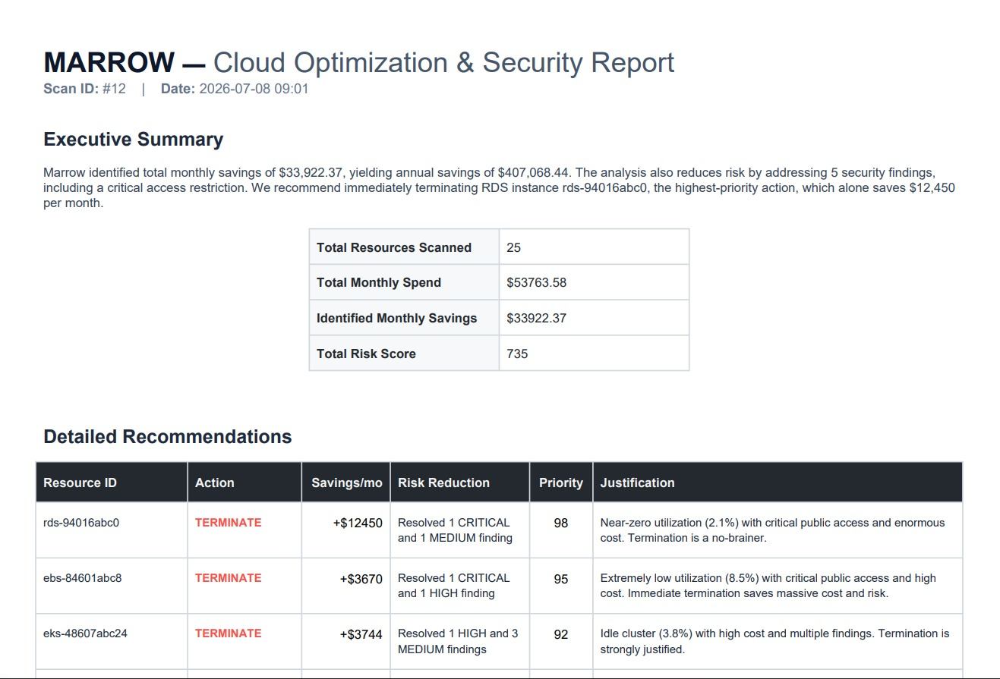

<div align="center">


### Every dollar you're wasting is a door you left open. Marrow finds both and tells you the one move that closes them.

Built in 5 days for **AMD Developer Hackathon ACT II** · Track 3: Unicorn 🦄

[](#amd--fireworks-in-action)
[](https://youtu.be/VW1X_at-EG8)
[](YOUR_DEMO_URL_HERE)
[](#installation)
[](#license)

</div>

⚠️ **Note on the live demo:** the public deployment intentionally runs without a live Fireworks API key, so it always uses Marrow's deterministic fallback reasoner — this protects API credits from public traffic. The dashboard, PDF export, confidence scoring, and executive summary all work identically; only the reasoning source differs. For real AI-generated recommendations powered by DeepSeek V4 Pro on AMD Instinct MI300X, clone the repo and add your own key (see [Installation](#installation)) — or see the **Live API Reasoning Example** below for genuine model output captured during development.

---

## ⚡ TL;DR for Judges

*   **The Problem:** FinOps sees cost, SecOps sees risk, but neither sees the whole picture. Enterprise teams waste hours arguing over which idle server to kill first.
*   **The Solution:** Marrow correlates your AWS billing data with your Security Hub findings, generating a unified dashboard where cost and risk are resolved in one click.
*   **AMD Integration:** Every recommendation (and justification) is reasoned live by an **AMD-hosted model via Fireworks AI**, processing structured JSON payloads per scan.
*   **Confidence-aware:** recommendations include a self-assessed certainty score, flagging genuinely ambiguous cases for human review instead of pretending every call is clear-cut.
*   **The Edge:** It's not a generic RAG chatbot. It's a deterministic, autonomous workflow that outputs stakeholder-ready PDF reports and strict `terminate/patch` decisions.

---

## Table of Contents

- [The Problem](#somebody-is-paying-rent-on-a-house-with-the-door-unlocked)
- [What Marrow Does](#what-marrow-does)
- [Features](#features)
- [Architecture](#architecture)
- [AMD + Fireworks in Action](#amd--fireworks-in-action)
- [Screenshots](#screenshots)
- [Why Nothing Else Does This](#why-nothing-else-does-this)
- [Tech Stack](#tech-stack)
- [Prerequisites](#prerequisites)
- [Installation](#installation)
  - [Option A: Docker (recommended)](#option-a--docker-recommended)
  - [Option B: Local Python setup](#option-b--local-python-setup)
- [Configuration](#configuration)
- [Usage](#usage)
  - [Web Dashboard](#web-dashboard)
  - [CLI Commands](#cli-commands)
  - [REST API](#rest-api)
- [Data Format Reference](#data-format-reference)
- [Example Walkthrough](#example-walkthrough)
- [Project Structure](#project-structure)
- [Troubleshooting](#troubleshooting)
- [Roadmap](#roadmap)
- [Contributing](#contributing)
- [Author](#author)
- [License](#license)

---

## Somebody is paying rent on a house with the door unlocked

There's an EC2 instance in your AWS account right now that nobody remembers creating. It costs $200 a month. It's also got an open port facing the internet.

Your FinOps tool sees the $200. Your Security tool sees the open port. **Neither one knows they're looking at the same box.**

That's not a tooling gap. It's a blind spot two entire departments have been staring past for years, because the software drawing the line between "wasteful" and "dangerous" was never built to see both at once.

Marrow sees both. Then it tells you the one action that solves both.

```
🔴 What you have today              🟢 What Marrow gives you
──────────────────────              ──────────────────────────
"$200/mo, flagged as waste"          "$200/mo, 3 open findings.
   - your cost tool                    Terminate it.
                                        Save $2,400/yr.
"3 findings, HIGH severity"             Remove 3 attack vectors."
   - your security tool

Two tools. Two teams.                One verdict. Zero guesswork.
Zero conversation.
```

---

## What Marrow Does

Marrow ingests two data sources most companies already have: **billing/cost data** and **security posture findings**. It joins them per cloud resource, and hands the correlated dataset to an AI reasoning layer. The model asks one question per resource: *cost, risk, or both — what's the move?*

Every resource gets exactly one verdict, with a dollar figure and a plain-English justification behind it — not a risk score only a security engineer can interpret.

| | Action | What it means |
|---|---|---|
| 🔴 | **terminate** | It's costing you and it's exposed. Kill it. |
| 🟡 | **rightsize** | You're paying for capacity nobody's using. Shrink it. |
| 🟠 | **patch** | Keep the resource, fix the finding. |
| 🔵 | **restrict-access** | Close the exposure, leave the resource alone. |
| ⚪ | **ignore** | It's healthy. Leave it alone. |

---

## Features

- 🔗 **Cross-domain correlation**: joins cost and security data on `resource_id`, something no cost tool or security tool does natively
- 🧠 **AI-generated reasoning**: every recommendation is produced by an AMD-hosted model via Fireworks AI, not a static rule table
- 🎯 **Confidence scoring**: every recommendation includes a 0-100 confidence rating; anything below 70 is flagged for human review
- 📝 **AI-generated executive summary**: a plain-English scan overview, generated by the same model, ready to hand to a stakeholder
- 📊 **Risk scoring**: weighted severity scoring (`CRITICAL`/`HIGH`/`MEDIUM`/`LOW`) rolled up per resource
- 🗂️ **Scan history**: every scan is persisted to SQLite, so you can track whether your attack surface is shrinking over time
- 💻 **Live dashboard**: ranked, color-coded recommendation cards with cost/risk visualizations
- 📄 **Exportable PDF reports**: a stakeholder-ready one-pager generated with ReportLab, matching the dashboard's color coding
- ⌨️ **Full CLI** — `scan`, `history`, and `report` commands for anyone who'd rather not touch a browser
- 🐳 **Fully containerized**: one `docker compose up` and the whole stack is running, no local Python setup required
- 🔌 **REST endpoint** — `/api/recommendations` for anyone who wants to pipe this into another tool

---

## Architecture



Nothing here is invented by the model. Every verdict traces back to a real line-item cost and a real finding. The AI reasons over your actual correlated data, it doesn't generate plausible-sounding text from nothing.

---

## AMD + Fireworks in Action

Take the reasoning layer out and Marrow is a script that joins two JSON files. Put it back in, and every verdict (the action, the dollar figure, the justification) is generated by **DeepSeek V4 Pro via Fireworks AI, which operates on AMD Instinct MI300X infrastructure as part of their FireAttention V3 inference stack.**

### Live API Reasoning Example
Below is an actual, unedited payload returned by the Fireworks AI endpoint during a scan. Notice how the model utilizes a `reasoning_content` block to transparently debate the cost vs. risk trade-offs before finalizing its verdict.

```json
{
  "model": "accounts/fireworks/models/deepseek-v4-pro",
  "choices": [
    {
      "message": {
        "role": "assistant",
        "reasoning_content": "We need to decide the best action based on utilization and security posture. Let's analyze each resource:\n\n1. rds-0efg5678hij90123e: RDS, cost $325, utilization 12.3%, findings: PUBLIC_ACCESS (CRITICAL), UNENCRYPTED_VOLUME (HIGH), MISSING_MFA (MEDIUM). Total risk 75. Low utilization, high cost, critical security issues. Action: terminate? Could also restrict-access for public access, but unencrypted volume and missing MFA are also issues. Terminate would save cost and eliminate all risks. Rightsize might be possible but utilization is very low, and security issues are severe. Terminate seems best. Monthly savings: $325, annual: $3900. Risk reduction: \"Resolved 1 CRITICAL, 1 HIGH, 1 MEDIUM findings\". Priority score: high due to cost and risk. Justification: \"Resource is severely underutilized (12.3%) and has critical security vulnerabilities including public access and unencrypted volume. Termination eliminates all risks and saves $325/month.\"\n\n... (evaluation continues for all resources) ...",
        "content": "{\n\"recommendations\": [\n{\n\"resource_id\": \"rds-0efg5678hij90123e\",\n\"action\": \"terminate\",\n\"monthly_savings_usd\": 325.0,\n\"annual_savings_usd\": 3900.0,\n\"risk_reduction\": \"Resolved 1 CRITICAL, 1 HIGH, 1 MEDIUM findings\",\n\"priority_score\": 90,\n\"justification\": \"Resource is severely underutilized (12.3%) and has critical security vulnerabilities including public access and unencrypted volume. Termination eliminates all risks and saves $325/month.\"\n}\n... ]}"
      }
    }
  ]
}
```

Marrow sends the full correlated dataset as a single batched request, not one API call per resource. This allows the model to reason across the entire account's cost and risk posture in one pass. It then returns structured, schema-constrained JSON rather than free-form text.

---

## Screenshots

<div align="center">

| Dashboard | PDF Report |
|:---:|:---:|
|  |  |
| Ranked by what actually matters | The one page your manager will actually read |

</div>

---

## Why Nothing Else Does This

| | Sees cost | Sees risk | Connects them |
|---|:---:|:---:|:---:|
| CloudHealth / Vantage | ✅ | ❌ | ❌ |
| Wiz / Security Hub / Prisma Cloud | ❌ | ✅ | ❌ |
| **Marrow** | ✅ | ✅ | ✅ |

Cost tools and security tools were built by different teams, solving different halves of the same problem. Marrow is the correlation layer neither side built, because neither side was looking at both datasets in the same room.

---

## Tech Stack

| Layer | Technology |
|---|---|
| Backend | Python 3.13, Flask |
| AI Reasoning | Fireworks AI API (DeepSeek V4 Pro, AMD MI300X infrastructure) |
| Database | SQLite |
| CLI | Click, Rich |
| Reporting | ReportLab (PDF generation) |
| Frontend | HTML/CSS (dark glassmorphism theme), Chart.js |
| Containerization | Docker, Docker Compose |

---

## Prerequisites

- **Docker** and **Docker Compose** ([install guide](https://docs.docker.com/get-docker/)) for the recommended setup
- *(Local setup only)* Python 3.13+ and pip
- A **Fireworks AI API key**: [sign up here](https://fireworks.ai) (free tier available; this hackathon build ran on AMD-hosted compute via Fireworks)
- Git

---

## Installation

### Option A: Docker (recommended)

This is the fastest path and matches exactly how the hackathon submission was tested.

```bash
# 1. Clone the repo
git clone https://github.com/nssriraam/marrow.git
cd marrow

# 2. Set up your environment file
cp .env.example .env
# Open .env and add your FIREWORKS_API_KEY

# 3. Build and start the container
docker compose up --build
```

Once the build finishes, the dashboard is live at:

```
http://localhost:5005
```

To stop the app:

```bash
docker compose down
```

To stop it **and** wipe stored scan history:

```bash
docker compose down -v
```

### Option B: Local Python setup

If you'd rather not use Docker:

```bash
# 1. Clone the repo
git clone https://github.com/nssriraam/marrow.git
cd marrow

# 2. Create and activate a virtual environment
python -m venv .venv

# On Windows:
.venv\Scripts\activate

# On macOS/Linux:
source .venv/bin/activate

# 3. Install dependencies
pip install -r requirements.txt

# 4. Set up your environment file
cp .env.example .env
# Add your FIREWORKS_API_KEY

# 5. Run the app
python run.py
```

Dashboard will be live at `http://localhost:5000`.

---

## Configuration

All configuration lives in `.env` (copy `.env.example` to get started). Variables:

| Variable | Required | Description |
|---|---|---|
| `FIREWORKS_API_KEY` | Yes* | Your Fireworks AI API key. If missing or blank, Marrow automatically falls back to a rule-based mock reasoner so the app still runs end-to-end. |
| `MODEL_NAME` | No | Fireworks model identifier to use for reasoning. Defaults to a sensible AMD-hosted model if unset. |
| `DB_PATH` | No | Path to the SQLite database file. Defaults to `marrow.db` in the root folder. |
| `BILLING_DATA_PATH` | No | Path to the billing JSON file. Defaults to `data/sample_billing.json`. |
| `FINDINGS_DATA_PATH` | No | Path to the security findings JSON file. Defaults to `data/sample_findings.json`. |

\* *Marrow will run without it in mock mode, but real AI-generated recommendations require a valid key.*

---

## Usage

### Web Dashboard

1. Start the app (Docker or local — see [Installation](#installation)).
2. Open `http://localhost:5000` in your browser.
3. Click **Run Scan** to correlate the current billing + findings data and generate fresh recommendations.
4. Review ranked, color-coded action cards — sorted by priority score, highest first.
5. Click **Download Report** on any scan to export a PDF summary.
6. Visit **History** to see every past scan and how recommendations have changed over time.

### CLI Commands

If using Docker, prefix each command with `docker exec marrow`. If running locally, drop that prefix.

```bash
# Run a new scan (correlates data, generates recommendations, saves to DB)
docker exec marrow python -m app.cli scan

# View all past scans
docker exec marrow python -m app.cli history

# Generate a PDF report for the most recent scan
docker exec marrow python -m app.cli report

# Generate a PDF report for a specific scan
docker exec marrow python -m app.cli report --scan-id 3
```

### REST API

| Endpoint | Method | Description |
|---|---|---|
| `/` | GET | Dashboard home page |
| `/scan` | POST | Triggers a new scan |
| `/history` | GET | Scan history page |
| `/api/recommendations` | GET | Returns the latest scan's recommendations as JSON |
| `/report/<scan_id>` | GET | Downloads the PDF report for a given scan ID |

Example:

```bash
curl http://localhost:5000/api/recommendations
```

```json
[
  {
    "resource_id": "i-0abc123def456",
    "action": "terminate",
    "monthly_savings_usd": 200.00,
    "annual_savings_usd": 2400.00,
    "risk_reduction": "Resolved 1 CRITICAL and 2 MEDIUM findings",
    "priority_score": 92,
    "confidence": 95,
    "justification": "Resource is severely underutilized (3.2%) with critical public access findings. Termination eliminates 3 attack vectors and saves $200/month."
  }
]
```

---

## Data Format Reference

Marrow expects two JSON files, joined on `resource_id`.

**Billing data** (`sample_billing.json`):

```json
{
  "resource_id": "i-0abc123def456",
  "service": "EC2",
  "monthly_cost_usd": 200.00,
  "utilization_pct": 3.2,
  "region": "us-east-1",
  "tags": { "env": "dev", "owner": "unknown" }
}
```

**Security findings** (`sample_findings.json`):

```json
{
  "resource_id": "i-0abc123def456",
  "finding_type": "OPEN_SECURITY_GROUP",
  "severity": "HIGH",
  "description": "Port 22 open to 0.0.0.0/0",
  "compliance_ref": "CIS 4.1"
}
```

Both files can be replaced with real exports from AWS Cost Explorer and AWS Security Hub. The correlator only requires the `resource_id` field to line up.

---

## Example Walkthrough

1. Marrow loads `sample_billing.json` and `sample_findings.json`.
2. The correlator joins them: an EC2 instance costing **$200/month** at **3.2% utilization** is matched with **3 findings** (one `HIGH`, two `MEDIUM`) on the same `resource_id`.
3. A `total_risk_score` is computed for that resource based on finding severity.
4. The correlated record is sent to the AI reasoner, which returns:
   > *action: terminate · monthly_savings: $200 · annual_savings: $2,400 · risk_reduction: 3 findings resolved · priority_score: 92 · confidence: 95*
5. The model also generates a 3-sentence executive summary highlighting total savings and the highest-priority action.
6. The recommendation is saved to SQLite and appears as a red **terminate** card on the dashboard, sorted near the top by priority.
7. Clicking **Download Report** produces a PDF with the same figure, ready to forward to a manager.

---

## Project Structure

```
marrow/
├── app/
│   ├── __init__.py
│   ├── config.py         # loads .env, centralizes settings
│   ├── correlator.py     # joins billing + findings on resource_id
│   ├── reasoner.py       # AI reasoning → structured JSON verdicts
│   ├── models.py         # SQLite schema + queries
│   ├── routes.py         # Flask routes
│   ├── cli.py            # scan / history / report commands
│   └── report.py         # PDF generation
├── data/
│   ├── sample_billing.json
│   └── sample_findings.json
├── static/                # CSS, JS, dashboard theme
├── templates/             # Flask HTML templates
├── reports/               # generated PDF output
├── Dockerfile
├── docker-compose.yml
├── requirements.txt
├── .env.example
└── README.md
```

---

## Troubleshooting

**Dashboard shows no data after starting the app**
Run a scan first — the app doesn't auto-populate on first boot. Use the **Run Scan** button or `docker exec marrow python -m app.cli scan`.

**Recommendations look generic / rule-based rather than AI-generated**
Check that `FIREWORKS_API_KEY` is set correctly in `.env` and that the container was rebuilt after editing it (`docker compose up --build`). Without a valid key, Marrow intentionally falls back to a mock reasoner rather than crashing.

**`docker compose up` fails to find `.env`**
Make sure you ran `cp .env.example .env` before starting the container, and that `.env` sits in the project root next to `docker-compose.yml`.

**Scan history disappears after restarting the container**
Confirm the SQLite volume mount in `docker-compose.yml` is intact. History is only preserved if `data/` is mounted as a volume, not baked into the image.

**PDF report fails to generate**
Run a scan first — `marrow report` requires at least one existing scan in the database.

**Scan takes several minutes to complete**
This is completely expected. The AMD-hosted DeepSeek V4 Pro model is performing deep Chain-of-Thought reasoning across all of your resources in a single pass. Grab a coffee and let the AI finish its analysis!

---

## Roadmap

- [ ] Azure and GCP support: same correlation engine, more cloud providers
- [ ] Approval-gated auto-remediation (not blind execution)
- [ ] Slack / PagerDuty alerts when a recommendation crosses a priority threshold
- [ ] Multi-account / multi-region aggregation

---

## Contributing

This was built solo for a 5-day hackathon, but issues and PRs are welcome after submission. If you spot a bug or have an idea, open an issue on GitHub.

---

## Author

**Sriraam Nagarajan** — [`@nssriraam`](https://github.com/nssriraam)

## License

MIT. See [LICENSE](LICENSE) for details.